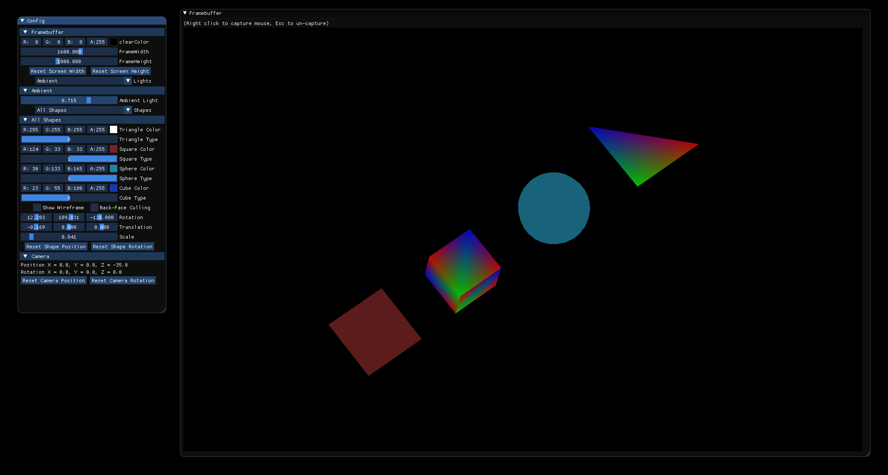

# Rasterizer

Rasterizer is a project about graphic pipelines and many other stuff about rasterization.

## Installation

```bash
make-j
```

## Run

```bash
./Rasterizer
```

## Usage

```python
-> Resize frame width and frame height
-> Reset Buttons for each features that deals with positions

-> Switch between diffuse and ambient light (diffuse not working but should be in theory)
-> diffuse and light alpha as well as diffuse position can be changed.

-> Switch between different Shapes (Triangle, Square, Cube, Sphere, All shapes, and Textured Cube Shape)
-> You can switch between color spectrum or uniformed static color (refer to "Shape's name" Type)
-> You can choose the shape color "(refer to Shape Color)"
-> You can rotate the shape on three axis (x,y,z) using matrix "(refer to Rotation)"
-> You can move the shape on three axis (x,y,z) using matrix "(refer to Translation)"
-> You can change the shape scale "(refer to Scale)"

-> Information displayed about Camera Position on three axis (x,y,z)
-> Information displayed about Camera Orientation on three axis (x,y,z)

# List of Available features
-> Etape 0 : Les maths - [x] 
-> Version 1 : Couleur - [x]
-> Version 2 : Z-Buffer - [x]
-> Version 3 : Eclairage avec modèle de Phong (not finished unfortunatly)  - [ ]
-> Version 4 : Per-pixel lighting & Blinn-Phong (not finished unfortunatly)  - [ ]
-> Version 5 : Projection - [x]
-> Version 6 : Texturing - [x]
-> Version 7 : Mode wireframe - [x]
-> Version 8 : Alpha-blending & Back-face culling (back face culling only and not working properly)  - [ ]
-> ersion 9 : Camera - [x]
-> Version 10 : Anti-aliasing - [ ]

# F2 Back-face culling
Turn On Back-face Culling (not working well but should be in theory ...)

# F1 Wireframe
Turn On Wireframe

# Movement 'Z, Q, S, D'
Movement are based on your mouse movement
```

## Triangle Preview

## Square Preview

## Sphere Preview

## Cube Preview

## Wireframe All Preview

## All Preview + Colors + Light Effect + Rotation & Transformation

## Texture Cube Preview


## Contribution
- Mathieu Robion - m.robion@student.isartdigital.com
- Mazurie Florestan - f.mazurie@student.isartdigital.com
